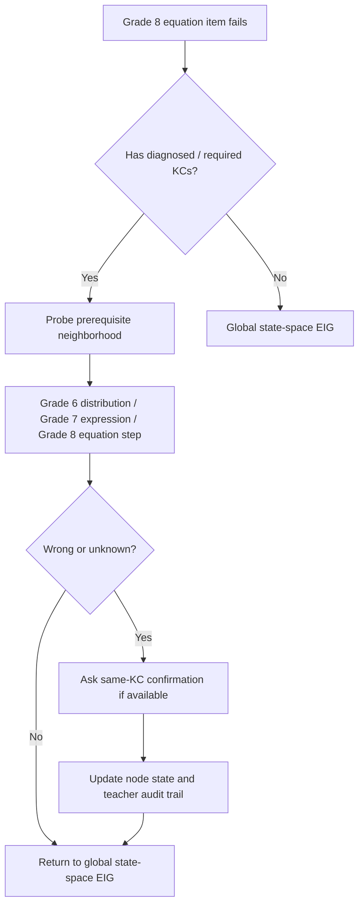

# Grade 8 Drill-Down Algorithm Handoff

## One-Line Summary

The Grade 8 drill-down algorithm is a policy layer on top of state-space EIG. Its job is to avoid “jumping around the graph” after a wrong answer and instead dig from a Grade 8 failure into the most likely Grade 7/6 prerequisite root cause.

It answers this product question:

> If a student fails a Grade 8 item, what should we ask next to understand whether the blocker is the Grade 8 skill itself or an earlier prerequisite gap?

## Why We Built It

The original selector was too broad. It picked high-information nodes across the graph, but after a student failed a high-level Grade 8 question, it could jump to another unrelated high-EIG node instead of probing the prerequisite chain.

That is not enough for our product goal.

For Wizzdom, the value proposition is not “adaptive test asks random high-information questions.” The value proposition is:

- open-ended answer reveals a likely misconception,
- graph maps that misconception to prerequisite KCs,
- assessment drills down into Grade 7/6 root causes,
- teacher can see why the engine asked each follow-up,
- output tells us what to remediate next.

User feedback that shaped this:

- “Cover many nodes” is not the right objective.
- If a Grade 8 node fails, the system should dig into prerequisites.
- If a Grade 6/7 prerequisite probe is wrong but not certain, ask a second item to confirm.
- If the assessment stops early while there are root-cause questions available, the algorithm is not meeting requirements.

## Where It Lives

Main engine:

- `backend/app/engines/assessment_v2/diagnostic_engine.py`

Main entry points:

- `V2DiagnosticEngine.select_next`
- `_grade8_unresolved_follow_up_candidates`
- `_grade8_deep_dive_candidates`
- `_grade8_deep_dive_target_kcs`

Frontend review consumes audit fields from:

- `run.frontier_history`

Important audit fields:

- `selector_policy`
- `reason`
- `deep_dive_reason`
- `source_failed_kc`
- `source_failed_item`
- `candidate_pool`
- `skipped_candidates`
- `top_candidates`

## High-Level Flow

Current `select_next` order:

```text
1. Try Grade 8 unresolved follow-up
   - Did the previous answer fail or unknown?
   - Can we ask a same-KC confirmation or nearby prerequisite probe?

2. Try Grade 8 deep-dive
   - Did the previous failed item explicitly point to diagnoses/requires/ancestors?
   - Probe those KCs inside the same target exam path.

3. Try global state-space EIG
   - Use particle-based expected information gain across the remaining graph.

4. Try confirmation phase
   - If breadth is exhausted, confirm uncertain/likely gap/likely mastered KCs.

5. If no candidates, complete the assessment.
```

In code:

```python
def select_next(run):
    selector = KnowledgeStateParticleSelector.from_run(...)

    candidates = _grade8_unresolved_follow_up_candidates(run, selector)
    if candidates:
        policy = "grade8_unresolved_follow_up"
        return best(candidates)

    candidates = _grade8_deep_dive_candidates(run, selector)
    if candidates:
        policy = "grade8_deep_dive"
        return best(candidates)

    candidates = _frontier_candidates(run, allow_confirmation=False, selector=selector)
    if candidates:
        policy = "state_space_eig"
        return best(candidates)

    candidates = _frontier_candidates(run, allow_confirmation=True, selector=selector)
    if candidates:
        policy = "confirmation"
        return best(candidates)

    return None
```

## The Two Drill-Down Layers

There are two related but different policies.

## 1. Unresolved Follow-Up

Function:

- `_grade8_unresolved_follow_up_candidates`

Purpose:

If the previous response was wrong or unknown, do not immediately leave that diagnostic area. First try to confirm or localize the gap.

This handles cases like:

- Student fails a Grade 8 item.
- Student fails a Grade 6/7 prerequisite probe.
- The node is still uncertain or even already likely gap, but we want a second direct evidence point if item pool allows.

Why this matters:

A single wrong answer may be:

- a real gap,
- a careless slip,
- a confusing prompt,
- an input/checker false negative.

So for official Grade 8 path, we allow up to 2 direct tests per KC.

Current rule:

- If previous answer was correct, no follow-up.
- If previous answer was wrong/unknown, build candidate KCs:
  - same KC first,
  - then `diagnoses_kcs`,
  - then `requires_kcs`,
  - then graph ancestors.
- Filter to `grade8_exam_path` items.
- Prefer same `target_exam_path`.
- Avoid duplicate `surface_signature` by default.
- If same KC has no distinct surface, allow parameterized same-surface fallback and mark `surface_relaxed=true`.

Important audit fields:

```json
{
  "selector_policy": "grade8_unresolved_follow_up",
  "reason": "grade8_confirm_unresolved_direct_miss",
  "deep_dive_reason": "wrong_on:g8-path-036; follow_up:same KC confirmation because one miss left the node unresolved; role:misconception",
  "source_failed_kc": "...",
  "source_failed_item": "g8-path-036",
  "candidate_pool": {
    "target_exam_path": "linear_equation",
    "source_probability_band": "likely_gap",
    "source_p_mastery": 0.75,
    "surface_relaxed": true
  }
}
```

### Example: Grade 6 Prerequisite Confirmation

Production issue:

Student answered item:

```text
KC: G6-MATH-BO-DAU-NGOAC
Question: Khai triển biểu thức 3(x - 2).
Answer: 3x-6
```

Previously:

- Parser incorrectly marked `3x-6` wrong.
- Node stayed around 75%.
- Engine moved on instead of asking another item.

Now:

- Parser accepts `3x-6`.
- If the answer is still wrong/unknown, engine tries a same-KC confirmation:

```text
Khai triển biểu thức 4(x - 3).
```

If this second item uses the same surface pattern, audit marks:

```text
surface_relaxed=true
```

That means:

> We asked a second parameterized item because we needed confirmation, but this is weaker evidence than a genuinely different diagnostic surface.

## 2. Deep-Dive

Function:

- `_grade8_deep_dive_candidates`

Purpose:

If an item fails and it has explicit diagnostic metadata, probe the target prerequisite or misconception KCs before going back to global EIG.

Deep-dive target sources:

1. `diagnoses_kcs`
2. `requires_kcs`
3. graph ancestors of the failed item KC
4. item KC itself

The algorithm keeps candidates inside the same `target_exam_path` when possible.

Example:

If a Grade 8 rational expression item fails:

```text
G8-MATH-RUT-GON-PHAN
Rút gọn phân thức (x^2 - 4)/[x(x + 2)]
```

The item metadata may point to prerequisites like:

- recognizing `A^2 - B^2`,
- factoring common factors,
- identifying common denominator,
- simplifying/cancelling factors.

The next question should be one of those probes, not an unrelated high-information Grade 8 node.

Audit example:

```json
{
  "selector_policy": "grade8_deep_dive",
  "reason": "grade8_deep_dive_after_failed_response",
  "deep_dive_reason": "wrong_on:g8-path-026; probe:required prerequisite; role:bridge",
  "source_failed_item": "g8-path-026"
}
```

## Relationship With State-Space EIG

The drill-down policy does not replace EIG.

It constrains the candidate pool first.

Within the drill-down candidate pool, candidates are still scored using the same state-space selector:

- entropy before,
- expected entropy after,
- information gain,
- split balance,
- item quality.

Then the policy adds bonuses:

- same-KC confirmation bonus,
- unknown-response bonus,
- target-order bonus,
- relaxed-surface penalty.

So the model is:

```text
policy chooses the diagnostic neighborhood
EIG chooses the best item inside that neighborhood
```

This is important. We are not saying “always ask the next prerequisite blindly.” We are saying:

> After a miss, restrict attention to the relevant root-cause neighborhood, then use EIG to choose the best probe.

## Why Same-KC Confirmation Exists

For the Grade 8 official path, one wrong answer should not always be treated as final.

Reasons:

- Student may slip.
- Prompt may be confusing.
- Open-ended syntax may create false wrong.
- Checker may miss an equivalent form.
- A root prerequisite gap has high remediation value, so we want direct confirmation when possible.

Therefore:

- Default breadth still prefers one item per KC.
- But after wrong/unknown, same KC can be tested up to 2 times.

Constant:

```python
GRADE8_MAX_TESTS_PER_KC = 2
```

## Why Same-Surface Fallback Exists

Ideal:

Two items for the same KC should have different `surface_signature`.

Example of different surfaces for “remove parentheses”:

- expand `3(x - 2)`,
- identify coefficient distribution error,
- fill missing term in `3(x - 2) = 3x + ___`,
- choose/enter the corrected first wrong step.

Current item bank problem:

Some KCs have multiple items, but they are just parameter variants.

Example:

```text
3(x - 2)
4(x - 3)
5(x - 1)
```

These share the same surface. They are not ideal independent evidence.

But user correctly pointed out:

> If the node is likely a gap and there is another item, it is worse to stop or move on without confirmation.

So current compromise:

- Avoid duplicate surface by default.
- If same-KC follow-up is needed and no distinct surface exists, allow parameterized same-surface fallback.
- Mark it in audit with `surface_relaxed=true`.

Interpretation:

- Good enough for pilot/product diagnostic.
- Not good enough as final psychometric-quality evidence.
- Content team should add truly distinct surfaces.

## Example Drill-Down Story

Suppose the student gets a Grade 8 equation item wrong:

```text
G8-MATH-GIAI-PHUONG-TRINH
Giải phương trình: 3(x - 2) + 5 = 2x.
```

The algorithm should not immediately jump to a separate Grade 8 function item.

It should ask:

1. Did the student fail because they cannot distribute?

```text
G6-MATH-BO-DAU-NGOAC
Khai triển biểu thức 3(x - 2).
```

2. If that is wrong or unknown, confirm same root skill:

```text
G6-MATH-BO-DAU-NGOAC
Khai triển biểu thức 4(x - 3).
```

3. If distribution is okay, probe equation-specific step:

```text
G8-MATH-KIEM-TRA-GIA
Tính vế trái trừ vế phải khi x = ...
```

4. Then return to broader Grade 8 EIG.

This is the intended behavior:



## Required Item Metadata

The drill-down algorithm only works if item metadata is high quality.

Important fields:

```json
{
  "official_assessment_scope": "grade8_exam_path",
  "target_exam_path": "linear_equation",
  "item_role": "misconception",
  "item_family": "expand_coefficient_parentheses",
  "surface_signature": "khai trien bieu thuc <num>(x - <num>)",
  "requires_kcs": ["..."],
  "diagnoses_kcs": ["..."],
  "answer_widget": "expression",
  "checker_type": "expression_equivalent"
}
```

Field meaning:

- `target_exam_path`: keeps drill-down inside a coherent exam strand.
- `item_role`: helps prioritize misconception/probe/anchor/bridge/transfer.
- `item_family`: prevents repeated identical skill forms and supports UI templates.
- `surface_signature`: prevents repeated surface patterns unless fallback is needed.
- `requires_kcs`: KCs likely required to answer correctly.
- `diagnoses_kcs`: KCs likely implicated by a wrong answer.

If `requires_kcs` and `diagnoses_kcs` are wrong or missing, the drill-down will be shallow or misleading.

## Role Priority

Current role ranking:

```python
GRADE8_DEEP_DIVE_ROLES = {
    "misconception": 0,
    "prerequisite_probe": 1,
    "anchor": 2,
    "bridge": 3,
    "confirmation": 4,
    "transfer": 5,
    "readiness": 6,
}
```

Lower rank means higher priority inside drill-down.

Interpretation:

- `misconception`: best after a wrong answer because it tests likely error pattern.
- `prerequisite_probe`: tests root skill.
- `anchor`: basic direct evidence.
- `bridge`: intermediate connection.
- `confirmation`: useful as second evidence.
- `transfer`: higher-level application.
- `readiness`: useful after state is clearer.

## How To Read Teacher Review

In review UI, each step should eventually explain:

```text
Why did we ask this question?
```

Possible explanations:

### Global EIG

```text
The engine selected this question because it was expected to reduce uncertainty across the current knowledge-state graph.
```

### Deep-Dive

```text
The previous answer was wrong/unknown on a Grade 8 item. This question probes a prerequisite or diagnosed misconception in the same exam path.
```

### Same-KC Confirmation

```text
The previous answer suggested a gap in this same skill. The engine asked a second item to confirm before making the root-cause conclusion.
```

### Same-Surface Fallback

```text
The item bank did not have a distinct second surface for this KC, so the engine used a parameterized follow-up. This is useful but weaker evidence.
```

## What Changed In Simulations

Before unresolved follow-up fix:

- weak-student simulations often stopped around 24-25 questions.
- some likely root gaps got only one direct item.

After fix:

- weak-student simulations use around 32-33 questions.
- wrong/unknown root probes get second confirmation when possible.
- duplicate item count remains 0.
- duplicate surface count can increase because of same-surface fallback.

This is expected.

Interpretation:

- Better root-cause digging.
- Still reveals content weakness: item bank needs distinct item surfaces.

## Known Limitations

### 1. The Algorithm Is Only As Good As Metadata

If `diagnoses_kcs` points to the wrong KC, the engine will drill down into the wrong place.

### 2. Same-Surface Confirmation Is A Compromise

It prevents premature stopping, but it is not high-quality independent evidence.

Content team should add distinct surface forms for high-impact KCs.

### 3. Widgets And Checkers Matter

If a student gives a mathematically valid answer but parser rejects it, the drill-down will chase a false gap.

This happened in production with:

- `3x-6`
- `x(x+2)`
- `0.06`
- percent expressions

Some parser fixes are done, but item/widget QA is still needed.

### 4. Deep-Dive Should Not Become Tunnel Vision

We want to confirm likely root cause, but not spend the whole assessment on one narrow skill unless the path requires it.

Current cap:

- max 2 items per KC.

This is the guardrail.

## Recommended Next Work

### For Engineering

1. Improve teacher review copy for:
   - `grade8_unresolved_follow_up`
   - `grade8_deep_dive`
   - `surface_relaxed=true`

2. Add explicit UI badges:
   - “Root-cause probe”
   - “Same skill confirmation”
   - “Same-surface fallback”

3. Build structured widgets:
   - equation builder,
   - expression builder,
   - ordered pair list,
   - rational expression template,
   - percent/rate expression widget.

4. Add diagnostic metrics:
   - number of deep-dive steps,
   - number of same-KC confirmations,
   - number of same-surface fallback steps,
   - KCs with only one distinct surface available.

### For Academic / Content

1. Add 2-3 distinct item surfaces for each high-impact Grade 6/7 prerequisite.

2. Review `requires_kcs` and `diagnoses_kcs` carefully.

3. Avoid raw “write an expression/equation” prompts unless there is a proper widget.

4. Prefer structured prompts:

```text
3(x - 2) = [ ]x + [ ]
```

instead of:

```text
Khai triển biểu thức 3(x - 2).
```

5. Mark parameter variants as weaker confirmation evidence.

## Mental Model For The Other Tech Team

Do not think of the Grade 8 drill-down as a separate algorithm that replaces adaptive selection.

Think of it as:

```text
State-space EIG = brain for uncertainty reduction
Drill-down policy = product/academic guardrail for root-cause diagnosis
Metadata = map that tells the engine where to drill
Widgets/checkers = measurement tool that prevents false evidence
```

If any one of these fails, the diagnostic result becomes unreliable.

The core behavior we need to preserve:

```text
Wrong Grade 8 answer
-> identify likely prerequisite neighborhood
-> ask Grade 7/6 probe or same-KC confirmation
-> update knowledge state
-> explain the path to teacher
-> return to broader EIG only after root-cause evidence is sufficient or item pool is exhausted
```

