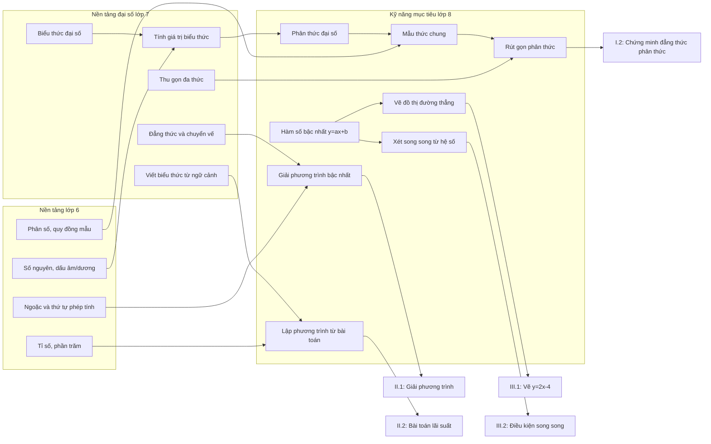
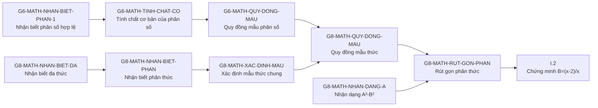
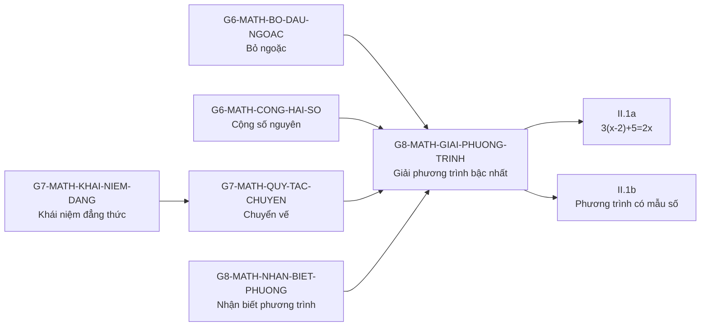
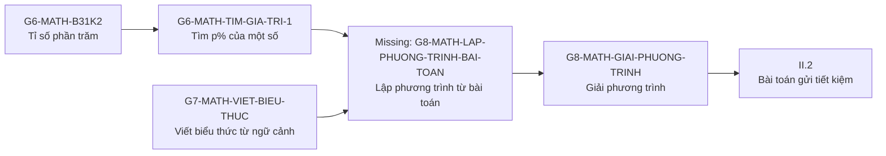
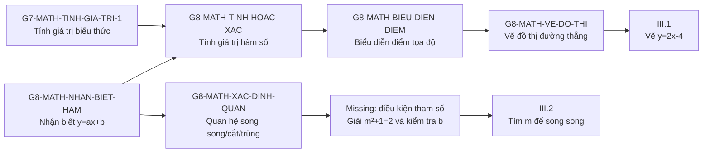

# Grade 8 Exam Question to Knowledge Node Mapping

Created: 2026-07-05  
Source: production `knowledge_components` and `kc_prerequisites`, read-only query.

## Context

This mapping is for the exam shown by the user:

- I.1: Given `A = x/(x+5)`, compute `A` when `x = 3`.
- I.2: Given `B = (x^2 - 2)/(x^2 + 2x) - 1/x + 1/(x+2)`, prove `B = (x - 2)/x`, with `x != 0, -2, -5`.
- II.1a: Solve `3(x - 2) + 5 = 2x`.
- II.1b: Solve `(x - 2)/3 + (2x - 3)/6 = 1`.
- II.2: Solve a savings interest word problem by setting up an equation.
- III.1: Draw the graph of `y = 2x - 4`.
- III.2: Find all `m` such that `y = 2x - 4` is parallel to `y = (m^2 + 1)x + m - 3`.

Observed student signal: the student can do I.1, but cannot do the remaining questions. This means the assessment should not conclude only "weak Grade 8 algebra"; it should dig into the prerequisite chain behind the failed tasks.

## Production Graph Coverage

For this exam, the existing graph has:

- **72 related existing nodes** when including Grade 6/7 prerequisites, Grade 8 target nodes, and closely connected algebra/function nodes.
- **90 internal edges** among that 72-node related set.
- A practical diagnostic should focus on a smaller **core set of about 35-45 nodes**, then ask 18-25 adaptive questions.

Important graph gaps found:

- No clearly named node for **addition/subtraction of algebraic fractions**. The graph has `G8-MATH-XAC-DINH-MAU`, `G8-MATH-QUY-DONG-MAU`, and `G8-MATH-RUT-GON-PHAN`, but I.2 also needs a distinct "combine rational expressions" KC.
- No clearly named Grade 8 node for **setting up a linear equation from a word problem**. The graph has Grade 7 expression-writing and Grade 8 linear-equation solving, but II.2 should have a bridge KC.
- `III.2` is partly covered by `G8-MATH-XAC-DINH-QUAN`, but the parameter step `m^2 + 1 = 2` requires solving a simple square equation and checking the intercept condition. That should be modeled explicitly if this exam type is important.

## High-Level Skill Map / Bản Đồ Kỹ Năng Tổng Quan



## Why Not Draw All 72 Nodes At Once?

Không nên vẽ toàn bộ 72 nodes trong một canvas mặc định. Với academic team, mục tiêu không phải "nhìn thấy mọi node", mà là thấy:

1. Câu hỏi đang kiểm tra node nào.
2. Node đó phụ thuộc vào node nào.
3. Nếu học sinh sai, hệ thống nên đào xuống hướng nào.
4. Nếu học sinh đúng, hệ thống có thể tự tin lan lên những node nào.

Vì vậy nên vẽ theo **path** hoặc **strand**. Đây cũng gần với cách ALEKS/KST hữu ích trong sản phẩm: không show một graph khổng lồ, mà show vùng kiến thức liên quan tới mục tiêu hiện tại và trạng thái của học sinh.

Recommended visualization modes:

- **Path view:** một câu hỏi hoặc một cụm câu hỏi -> prerequisite chain -> downstream skills.
- **Strand view:** phân thức, phương trình, mô hình hóa, hàm số.
- **Focus + context:** node đang xét rõ nhất; prerequisite/downstream cấp 1 rõ; cấp 2 mờ; phần còn lại ẩn.
- **Evidence overlay:** node nào được test trực tiếp, node nào chỉ suy luận, node nào cần hỏi tiếp.

## Path Maps For This Exam

### Path 1: I.2 Rational Expression Transformation



Diagnostic use:

- Nếu sai ở `x^2 + 2x = x(x+2)`, đào vào đa thức/factorization.
- Nếu sai ở mẫu chung `x(x+2)`, đào vào `G8-MATH-XAC-DINH-MAU`.
- Nếu sai khi đổi `1/x` thành `(x+2)/(x(x+2))`, đào vào quy đồng mẫu thức.
- Nếu sai khi rút `x^2-4`, đào vào hiệu hai bình phương.

### Path 2: II.1 Linear Equation Mechanics



Diagnostic use:

- Nếu sai II.1a, hỏi tiếp bỏ ngoặc/chuyển vế trước.
- Nếu đúng II.1a nhưng sai II.1b, vấn đề có thể là phân số trong phương trình, không phải equation core.

### Path 3: II.2 Word Problem Modeling



Diagnostic use:

- Nếu không biết `300-x`, gap là modeling.
- Nếu không biết `6% = 0.06`, gap là percent.
- Nếu lập đúng phương trình nhưng giải sai, gap là equation mechanics.

### Path 4: III Linear Function And Parallel Lines



Diagnostic use:

- Nếu không vẽ được III.1, tách thành: tính điểm, đặt điểm, nối đường.
- Nếu III.2 trả lời `m=±1`, gap là phân biệt song song và trùng nhau.
- Nếu không lập được `m²+1=2`, gap nằm ở đọc hệ số góc từ hàm số chứa tham số.

## Question Mapping

### I.1. Compute `A = x/(x+5)` at `x = 3`

Expected answer: `3/8`.

Student got this correct. This confirms only a narrow skill: substituting one value into a simple algebraic fraction and evaluating.

Primary node:

| Code | Name | DB description excerpt |
|---|---|---|
| `G8-MATH-TINH-GIA-TRI` | Tính giá trị của phân thức | "Học sinh thay giá trị của biến vào phân thức, kiểm tra mẫu khác 0, rồi tính giá trị biểu thức số nhận được. Ví dụ: `(x² - x - 1)/(x² + 3x)` tại `x = 2`: ... = `1/10`." |

Connected nodes by edge:

| Edge | Interpretation |
|---|---|
| `G8-MATH-NHAN-BIET-PHAN -> G8-MATH-TINH-GIA-TRI` | To evaluate a rational expression, the student must recognize numerator/denominator structure. |
| `G7-MATH-TINH-GIA-TRI-1 -> G8-MATH-TINH-GIA-TRI` | Evaluating algebraic expressions is a prerequisite-like bridge into evaluating rational expressions. |

Assessment interpretation:

- This correct answer should **not** infer mastery of rational-expression transformation.
- It does support that the student can do direct substitution when the expression is simple and no symbolic manipulation is required.

### I.2. Prove `B = (x - 2)/x`

Target work:

```text
B = (x^2 - 2)/(x^2 + 2x) - 1/x + 1/(x+2)
  = (x^2 - 2)/(x(x+2)) - (x+2)/(x(x+2)) + x/(x(x+2))
  = (x^2 - 2 - x - 2 + x)/(x(x+2))
  = (x^2 - 4)/(x(x+2))
  = (x-2)(x+2)/(x(x+2))
  = (x-2)/x
```

Primary nodes:

| Code | Name | DB description excerpt |
|---|---|---|
| `G8-MATH-NHAN-BIET-PHAN` | Nhận biết phân thức đại số, xác định tử thức, mẫu thức | "Học sinh nhận biết được biểu thức dạng `A/B`, trong đó `A, B` là đa thức và `B` không phải đa thức 0; xác định được tử thức và mẫu thức..." |
| `G8-MATH-XAC-DINH-MAU` | Xác định mẫu thức chung và nhân tử phụ | "Ở phân thức, mẫu là đa thức đã phân tích thành nhân tử... MTC là... Học sinh cần chọn hệ số: BCNN; mỗi nhân tử đại số: lấy số mũ cao nhất." |
| `G8-MATH-QUY-DONG-MAU` | Quy đồng mẫu thức nhiều phân thức | "Sau khi tìm được MTC, học sinh phải nhân cả tử và mẫu với nhân tử phụ là một biểu thức đại số..." |
| `G8-MATH-RUT-GON-PHAN` | Rút gọn phân thức bằng nhân tử chung | "Cái mới là: phân tích tử/mẫu thành nhân tử, nhận ra nhân tử chung là cả một biểu thức, không gạch hạng tử trong tổng, xử lý nhân tử đối dấu..." |
| `G8-MATH-NHAN-DANG-A` | Nhận dạng `A² - B²` và viết thành `(A - B)(A + B)` | "Học sinh nhận ra một biểu thức là hiệu của hai bình phương và viết được dưới dạng tích: `A² - B² = (A - B)(A + B)`. Ví dụ: `x² - 4 = (x - 2)(x + 2)`." |
| `G8-MATH-PHAN-TICH-DA` | Phân tích đa thức thành nhân tử bằng cách đặt nhân tử chung | "Học sinh nhận ra nhân tử xuất hiện chung trong tất cả các hạng tử của đa thức, đưa nhân tử đó ra ngoài ngoặc..." |

Connected nodes by edge:

| Edge | Interpretation |
|---|---|
| `G8-MATH-NHAN-BIET-DA -> G8-MATH-NHAN-BIET-PHAN` | Algebraic fractions depend on recognizing numerator and denominator as polynomials. |
| `G8-MATH-NHAN-BIET-PHAN -> G8-MATH-XAC-DINH-MAU` | To combine fractions, the student must identify denominators and common denominator. |
| `G8-MATH-XAC-DINH-MAU -> G8-MATH-QUY-DONG-MAU` | Once common denominator and auxiliary factors are known, the student can convert expressions to common denominator. |
| `G8-MATH-NHAN-BIET-PHAN -> G8-MATH-RUT-GON-PHAN` | Simplifying rational expressions depends on recognizing algebraic fractions. |
| `G6-MATH-TINH-CHAT-CO -> G8-MATH-QUY-DONG-MAU` | The fraction property from Grade 6 is reused at algebraic-fraction level. |
| `G6-MATH-TINH-CHAT-CO -> G8-MATH-RUT-GON-PHAN` | Simplifying a rational expression is an algebraic extension of simplifying equivalent fractions. |
| `G8-MATH-NHAN-DANG-A -> G8-MATH-BIEN-DOI-TICH` | Recognizing `x² - 4` as difference of squares supports the cancellation step. |
| `G8-MATH-PHAN-TICH-DA -> G8-MATH-PHAN-TICH-DA-1` | Factorization by common factor precedes more complex factorization by grouping. |

Missing or weak graph coverage:

- This question centrally tests **addition/subtraction of algebraic fractions with unlike denominators**. The production graph has common-denominator and simplification nodes, but no clearly separate node for "cộng/trừ phân thức đại số".
- Suggested new node: `G8-MATH-CONG-TRU-PHAN-THUC` — "Cộng/trừ nhiều phân thức đại số bằng cách quy đồng mẫu thức, cộng/trừ tử thức, rồi rút gọn kết quả."

Diagnostic explanation if the student fails:

- A failure here could mean the gap is not one node. It may be any of:
  - cannot factor `x^2 + 2x = x(x+2)`;
  - cannot find common denominator `x(x+2)`;
  - cannot transform `1/x` into `(x+2)/(x(x+2))`;
  - cannot combine numerators with signs;
  - cannot recognize `x^2 - 4`;
  - cancels terms incorrectly inside sums.

### II.1a. Solve `3(x - 2) + 5 = 2x`

Expected solution:

```text
3x - 6 + 5 = 2x
3x - 1 = 2x
x = 1
```

Primary nodes:

| Code | Name | DB description excerpt |
|---|---|---|
| `G8-MATH-GIAI-PHUONG-TRINH` | Giải phương trình bậc nhất một ẩn dạng `ax+b=0` | "Giải phương trình bậc nhất một ẩn ở dạng trực tiếp `ax+b=0`, `a != 0`, bằng cách chuyển hạng tử tự do và chia cho hệ số của `x`." |
| `G7-MATH-QUY-TAC-CHUYEN` | Quy tắc chuyển vế — tìm x trong đẳng thức | DB description is currently blank, but this node is connected in graph and corresponds to the Grade 7 transposition rule. |
| `G6-MATH-BO-DAU-NGOAC` | Bỏ dấu ngoặc có dấu `+` đằng trước | "Học sinh có thể bỏ đúng dấu ngoặc trong biểu thức có dấu `+` đứng ngay trước ngoặc, giữ nguyên dấu..." |

Connected nodes by edge:

| Edge | Interpretation |
|---|---|
| `G7-MATH-NHAN-BIET-BIEU -> G8-MATH-NHAN-BIET-PHUONG` | A student must recognize an equation as two expressions related by `=`. |
| `G8-MATH-NHAN-BIET-PHUONG -> G8-MATH-NHAN-BIET-PHUONG-1` | Recognizing one-variable equations precedes recognizing first-degree linear equations. |
| `G7-MATH-QUY-TAC-CHUYEN -> G8-MATH-GIAI-PHUONG-TRINH` | The transposition rule is a prerequisite for solving linear equations. |
| `G8-MATH-NHAN-BIET-PHUONG -> G8-MATH-KIEM-TRA-GIA` | Checking a proposed solution is connected but easier than solving. |

Diagnostic explanation if the student fails:

- Since the student succeeded at substitution in I.1, a failure here likely points to:
  - distribution/parentheses issue: `3(x-2)`;
  - combining constants: `-6 + 5`;
  - moving `2x` across the equality;
  - knowing how to isolate `x`.

### II.1b. Solve `(x - 2)/3 + (2x - 3)/6 = 1`

Expected solution:

```text
2(x - 2)/6 + (2x - 3)/6 = 1
(2x - 4 + 2x - 3)/6 = 1
4x - 7 = 6
4x = 13
x = 13/4
```

Primary nodes:

| Code | Name | DB description excerpt |
|---|---|---|
| `G8-MATH-GIAI-PHUONG-TRINH` | Giải phương trình bậc nhất một ẩn dạng `ax+b=0` | "Giải phương trình bậc nhất một ẩn ở dạng trực tiếp `ax+b=0`, `a != 0`, bằng cách chuyển hạng tử tự do và chia cho hệ số của `x`." |
| `G6-MATH-QUY-DONG-MAU` | Quy đồng mẫu các phân số có tử/mẫu nguyên | "Sau khi chọn mẫu chung, nhân cả tử và mẫu của mỗi phân số với cùng một số nguyên khác 0. Quy đồng không làm thay đổi giá trị phân số..." |
| `G6-MATH-CONG-HAI-PHAN-1` | Cộng hai phân số khác mẫu bằng cách quy đồng mẫu | "Học sinh có thể cộng đúng hai phân số khác mẫu bằng cách quy đồng mẫu hai phân số, cộng hai phân số cùng mẫu sau quy đồng..." |
| `G7-MATH-QUY-TAC-CHUYEN` | Quy tắc chuyển vế — tìm x trong đẳng thức | DB description is currently blank, but graph uses this as a prerequisite for Grade 8 linear equations. |

Connected nodes by edge:

| Edge | Interpretation |
|---|---|
| `G6-MATH-NHAN-BIET-PHAN-1 -> G6-MATH-QUY-DONG-MAU` | Recognizing fractions is prerequisite to common denominator. |
| `G6-MATH-TINH-CHAT-CO -> G6-MATH-QUY-DONG-MAU` | Equivalent-fraction property underlies common denominator. |
| `G6-MATH-QUY-DONG-MAU -> G6-MATH-CONG-HAI-PHAN-1` | Adding unlike fractions depends on common denominator. |
| `G7-MATH-QUY-TAC-CHUYEN -> G8-MATH-GIAI-PHUONG-TRINH` | After clearing/combining fractions, equation solving requires transposition. |

Diagnostic explanation if the student fails:

- This item is not a pure equation item. It mixes equation solving with fraction common-denominator operations.
- If a student fails II.1b but can solve II.1a, the gap is likely fraction handling inside equations.
- If a student fails both II.1a and II.1b, first diagnose equation mechanics before fraction equations.

### II.2. Interest word problem

Problem structure:

Let `x` be money in bank A. Then bank B has `300 - x`.

```text
0.06x + 0.058(300 - x) = 17.72
0.06x + 17.4 - 0.058x = 17.72
0.002x = 0.32
x = 160
Bank A: 160 million; Bank B: 140 million
```

Primary nodes:

| Code | Name | DB description excerpt |
|---|---|---|
| `G7-MATH-VIET-BIEU-THUC` | Viết biểu thức đại số biểu thị quan hệ từ ngữ cảnh thực tế hoặc bài toán hình học | DB description is currently blank, but node name directly matches converting word context into algebraic expression. |
| `G6-MATH-B31K2` | Tính tỉ số của hai số và viết dưới dạng tỉ số phần trăm | "Học sinh có thể tính tỉ số của hai số bằng phép chia, sau đó viết tỉ số đó dưới dạng tỉ số phần trăm khi cần..." |
| `G6-MATH-TIM-GIA-TRI-1` | Tìm giá trị phần trăm của một số | "Học sinh có thể tìm đúng `p%` của một số `m` bằng cách đổi `p%` thành `p/100` hoặc số thập phân rồi nhân với `m`." |
| `G8-MATH-GIAI-PHUONG-TRINH` | Giải phương trình bậc nhất một ẩn dạng `ax+b=0` | "Giải phương trình bậc nhất một ẩn ở dạng trực tiếp `ax+b=0`..." |

Connected nodes by edge:

| Edge | Interpretation |
|---|---|
| `G7-MATH-VIET-BIEU-THUC -> G7-MATH-NHAN-BIET-BIEU` | Modeling begins with writing an algebraic expression from context. |
| `G7-MATH-NHAN-BIET-BIEU -> G8-MATH-NHAN-BIET-PHUONG` | A modeled relationship becomes a one-variable equation. |
| `G7-MATH-QUY-TAC-CHUYEN -> G8-MATH-GIAI-PHUONG-TRINH` | Solving the resulting equation depends on transposition. |
| `G6-MATH-B31K2 -> G6-MATH-TIM-GIA-TRI-1` | Percent calculation depends on understanding ratio/percentage. |
| `G6-MATH-B31K2 -> G6-MATH-TIM-MOT-SO` | Related downstream percent skill; not directly required here but close. |

Missing or weak graph coverage:

- There should be a Grade 8 bridge node for **lập phương trình từ bài toán thực tế**.
- Suggested new node: `G8-MATH-LAP-PHUONG-TRINH-BAI-TOAN` — "Đọc bài toán thực tế, chọn ẩn, biểu diễn các đại lượng còn lại theo ẩn, lập phương trình bậc nhất một ẩn."

Diagnostic explanation if the student fails:

- This question has high hidden cognitive load:
  - choose unknown;
  - express the other amount as `300 - x`;
  - convert `6%` and `5.8%`;
  - write interest expression;
  - solve equation with decimals.
- A failure here should not immediately mark only `G8-MATH-GIAI-PHUONG-TRINH` as gap. The item needs step-level evidence.

### III.1. Draw graph of `y = 2x - 4`

Expected process:

Choose two points, for example:

```text
x = 0 => y = -4 => (0, -4)
x = 2 => y = 0  => (2, 0)
Draw the line through these two points.
```

Primary nodes:

| Code | Name | DB description excerpt |
|---|---|---|
| `G8-MATH-NHAN-BIET-HAM` | Nhận biết hàm số bậc nhất và xác định hệ số `a,b` | "Học sinh nhận ra được hàm số có dạng `y=ax+b`, với `a != 0`, và xác định đúng hệ số `a`, hằng số `b`." |
| `G8-MATH-TINH-HOAC-XAC` | Tính hoặc xác định giá trị hàm số tại một giá trị của biến | "Học sinh hiểu `f(a)` là giá trị của `y` khi `x = a`. Nếu cho công thức thì thay `x = a` vào tính..." |
| `G8-MATH-BIEU-DIEN-DIEM` | Biểu diễn điểm trên mặt phẳng tọa độ khi biết tọa độ | "Học sinh đặt được điểm `R(2; -2)`, `S(-1; 2)`, `C(0; -2)`, `D(-1; 0)` trên hệ trục tọa độ." |
| `G8-MATH-VE-DO-THI` | Vẽ đồ thị hàm số bậc nhất bằng đường thẳng đi qua hai điểm thuộc đồ thị | "Học sinh biết đồ thị của hàm số bậc nhất là một đường thẳng, nên để vẽ đồ thị chỉ cần xác định hai điểm thuộc đồ thị rồi vẽ đường thẳng đi qua hai điểm đó." |

Connected nodes by edge:

| Edge | Interpretation |
|---|---|
| `G7-MATH-TINH-GIA-TRI-1 -> G8-MATH-TINH-HOAC-XAC` | Function-value calculation extends expression evaluation. |
| `G8-MATH-BIEU-DIEN-DIEM -> G8-MATH-BIEU-DIEN-DO` | Plotting points supports graph representation from a table. |
| `G8-MATH-BIEU-DIEN-DIEM -> G8-MATH-VE-DO-THI` | Drawing a line graph requires plotting points. |
| `G8-MATH-NHAN-BIET-HAM -> G8-MATH-VE-DO-THI` | Recognizing `y=ax+b` precedes drawing its graph. |
| `G8-MATH-TINH-HOAC-XAC -> G8-MATH-VE-DO-THI` | To draw the line, the student computes two coordinate pairs. |

Diagnostic explanation if the student fails:

- Failure can come from:
  - not knowing a linear graph is a line;
  - cannot compute `y` values;
  - cannot plot coordinate points;
  - cannot choose convenient points like intercepts.

### III.2. Find `m` so the two lines are parallel

Target reasoning:

```text
d1: y = 2x - 4 => slope a1 = 2
d2: y = (m^2 + 1)x + m - 3 => slope a2 = m^2 + 1

Parallel requires equal slopes and different intercepts:
m^2 + 1 = 2
m^2 = 1
m = 1 or m = -1

Check intercepts:
if m = 1, b2 = -2, different from -4 => parallel
if m = -1, b2 = -4, same intercept and same slope => same line, not parallel as distinct lines

Answer: m = 1
```

Primary nodes:

| Code | Name | DB description excerpt |
|---|---|---|
| `G8-MATH-XAC-DINH-QUAN` | Xác định quan hệ song song, cắt nhau hoặc trùng nhau của hai đường thẳng từ hệ số trong phương trình | "Với hai đường thẳng `y=ax+b` và `y=a'x+b'`: nếu `a=a'`, `b != b'` thì song song; nếu `a=a'`, `b=b'` thì trùng nhau; nếu `a != a'` thì cắt nhau." |
| `G8-MATH-NHAN-BIET-HAM` | Nhận biết hàm số bậc nhất và xác định hệ số `a,b` | "Học sinh nhận ra được hàm số có dạng `y=ax+b`, với `a != 0`, và xác định đúng hệ số `a`, hằng số `b`." |

Connected nodes by edge:

| Edge | Interpretation |
|---|---|
| `G8-MATH-NHAN-BIET-HAM -> G8-MATH-XAC-DINH-QUAN` | To compare two lines, the student must first identify coefficients `a` and `b`. |
| `G8-MATH-NHAN-BIET-HAM -> G8-MATH-NHAN-BIET-HUONG` | Related: slope sign determines line direction. |
| `G8-MATH-NHAN-BIET-HAM -> G8-MATH-VE-DO-THI` | Same linear-function foundation supports drawing graphs. |

Missing or weak graph coverage:

- The graph covers comparing coefficients, but not the parameter-solving subskill `m^2 + 1 = 2`.
- Suggested support node: `G8-MATH-GIAI-DIEU-KIEN-THAM-SO-DUONG-THANG` — "Từ điều kiện song song/cắt nhau/trùng nhau, lập và giải điều kiện theo tham số, rồi kiểm tra điều kiện phụ."

Diagnostic explanation if the student fails:

- If the student can identify slope/intercept but cannot solve `m^2=1`, the gap is not graphing; it is algebraic condition solving.
- If the student returns `m = ±1`, the gap is specifically the distinction between **parallel distinct** and **coincident** lines.

## Core Related Node List

This is the recommended core set for a focused diagnostic based on the exam. It is smaller than the 72-node full related set.

### Rational Expressions Cluster

| Code | Role |
|---|---|
| `G8-MATH-NHAN-BIET-PHAN` | Recognize algebraic fraction, numerator, denominator. |
| `G8-MATH-XAC-DINH-DIEU` | Determine domain / denominator nonzero condition. |
| `G8-MATH-XAC-DINH-MAU` | Find common denominator and auxiliary factor. |
| `G8-MATH-QUY-DONG-MAU` | Convert algebraic fractions to common denominator. |
| `G8-MATH-RUT-GON-PHAN` | Simplify rational expression by common factor. |
| `G8-MATH-KIEM-TRA-HAI` | Check equality of algebraic fractions by cross product. |
| `G8-MATH-NHAN-DANG-A` | Recognize `A²-B²`. |
| `G8-MATH-PHAN-TICH-DA` | Factor by common factor. |
| `G8-MATH-NHAN-BIET-DA` | Recognize polynomial terms. |
| `G8-MATH-THU-GON-DA` | Combine like terms in polynomial. |

### Equation Cluster

| Code | Role |
|---|---|
| `G8-MATH-NHAN-BIET-PHUONG` | Recognize one-variable equation. |
| `G8-MATH-KIEM-TRA-GIA` | Check a value is a solution. |
| `G8-MATH-NHAN-BIET-PHUONG-1` | Recognize first-degree equation. |
| `G8-MATH-GIAI-PHUONG-TRINH` | Solve linear equation. |
| `G7-MATH-KHAI-NIEM-DANG` | Equality concept. |
| `G7-MATH-QUY-TAC-CHUYEN` | Transposition rule. |
| `G6-MATH-BO-DAU-NGOAC` | Remove parentheses with plus sign. |
| `G6-MATH-BO-DAU-NGOAC-1` | Remove parentheses with minus sign. |

### Fraction Foundation Cluster

| Code | Role |
|---|---|
| `G6-MATH-NHAN-BIET-PHAN-1` | Recognize valid fraction with nonzero denominator. |
| `G6-MATH-TINH-CHAT-CO` | Equivalent fraction property. |
| `G6-MATH-QUY-DONG-MAU` | Common denominator for fractions. |
| `G6-MATH-CONG-HAI-PHAN-1` | Add unlike fractions by common denominator. |
| `G6-MAMATMATHMAT` | Subtract unlike fractions. |
| `G6-MATH-NHAN-BIET-HAI` | Cross-multiplication equality check. |

### Word Problem / Percent Cluster

| Code | Role |
|---|---|
| `G7-MATH-VIET-BIEU-THUC` | Write algebraic expression from context. |
| `G7-MATH-NHAN-BIET-BIEU` | Recognize algebraic expression. |
| `G6-MATH-B31K2` | Ratio and percent. |
| `G6-MATH-TIM-GIA-TRI-1` | Find percent of a number. |
| `G6-MATH-TIM-MOT-SO` | Find a number from percentage value. |

### Linear Function / Graph Cluster

| Code | Role |
|---|---|
| `G8-MATH-NHAN-BIET-HAM` | Recognize `y=ax+b`, identify `a,b`. |
| `G8-MATH-TINH-HOAC-XAC` | Compute function value. |
| `G8-MATH-BIEU-DIEN-DIEM` | Plot point on coordinate plane. |
| `G8-MATH-BIEU-DIEN-DO` | Represent graph from value table. |
| `G8-MATH-VE-DO-THI` | Draw linear graph through two points. |
| `G8-MATH-XAC-DINH-QUAN` | Compare lines by coefficients. |
| `G8-MATH-NHAN-BIET-HUONG` | Recognize direction from slope sign. |

## Suggested Deep Diagnostic for This Student

Goal: find the first actionable blocker, not retest the whole exam.

Recommended cap: **18-25 questions**.

### Phase 1: Rational expression diagnosis, 6-8 questions

Ask one question per subskill:

1. Identify denominator and domain of `x/(x+2)`.
2. Factor `x^2 + 2x`.
3. Factor `x^2 - 4`.
4. Find common denominator of `1/x` and `1/(x+2)`.
5. Convert `1/x` to denominator `x(x+2)`.
6. Combine `(x^2 - 2)/(x(x+2)) - (x+2)/(x(x+2))`.
7. Simplify `(x^2 - 4)/(x(x+2))`.

Stop early if the student fails two adjacent prerequisites, because then I.2 is not the right level yet.

### Phase 2: Equation mechanics, 5-6 questions

1. Expand `3(x-2)`.
2. Solve `3x - 1 = 2x`.
3. Solve `x/3 + 1/6 = 1`.
4. Solve `(x-2)/3 + (2x-3)/6 = 1` with scaffolding removed.
5. Check solution by substitution.

### Phase 3: Modeling, 3-5 questions

1. Convert `6%` and `5.8%` to decimal.
2. If total is `300` and one part is `x`, express the other part.
3. Write interest from amount `x` at `6%`.
4. Build equation from total interest.

### Phase 4: Linear function, 5-6 questions

1. Identify `a,b` in `y=2x-4`.
2. Compute `y` for `x=0` and `x=2`.
3. Plot `(0,-4)` and `(2,0)`.
4. Choose whether two lines are parallel from `a,b`.
5. Solve `m^2+1=2`.
6. Check `b` condition to distinguish parallel vs coincident.

## Product Notes

For adaptive assessment, this exam should be treated as a **diagnostic seed**:

- Correct I.1 gives evidence for simple substitution only.
- Failing I.2 should branch into rational-expression subskills, not just mark "phân thức gap".
- Failing II.1a and II.1b should branch differently:
  - II.1a failure: equation mechanics / parentheses / transposition.
  - II.1b failure with II.1a correct: fraction equation.
- Failing II.2 should not be graded as only equation solving; it is mainly modeling plus percent.
- Failing III.2 may be graph concept, coefficient comparison, or parameter solving. The assessment must separate these.

Recommended graph updates before using this as production-quality diagnostic:

1. Add `G8-MATH-CONG-TRU-PHAN-THUC`.
2. Add `G8-MATH-LAP-PHUONG-TRINH-BAI-TOAN`.
3. Add or map `G8-MATH-GIAI-DIEU-KIEN-THAM-SO-DUONG-THANG`.
4. Fill blank descriptions for `G7-MATH-QUY-TAC-CHUYEN`, `G7-MATH-TINH-GIA-TRI-1`, and `G7-MATH-VIET-BIEU-THUC`.
