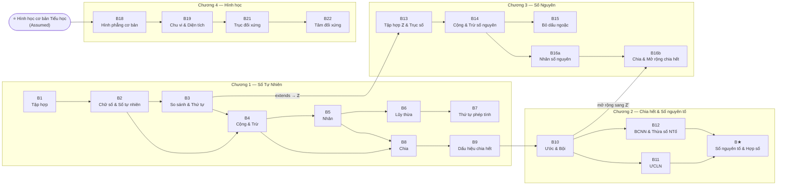
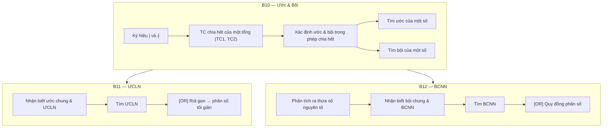
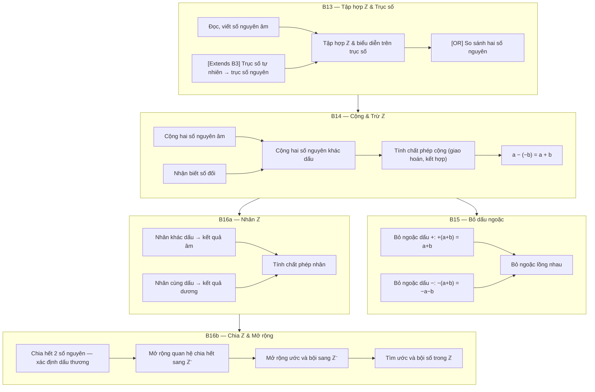
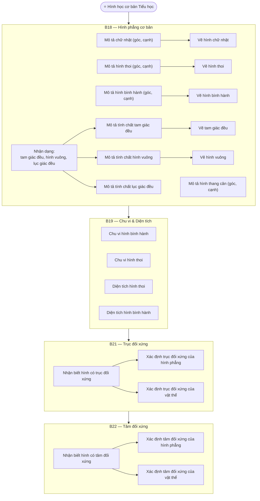

# Bản đồ Kiến thức Toán Lớp 6

## Giải mã ID

| Ký hiệu | Ý nghĩa | Ví dụ |
|---------|---------|-------|
| B | Bài / Block | B1 = Block 1 |
| C | Chương / Chapter | C1 = Chương 1 |
| K | Khối | K1 |
| L | Lớp / Grade | L6 = Lớp 6 |

---

## Sơ đồ phụ thuộc — Cấp độ Block

---

## Chương 1 — Số Tự Nhiên (C1)

### B1.C1.K1.L6 — Tập hợp

**Kỹ năng:**
- `1.1.1.6` Nhận biết tập hợp và liệt kê tập hợp
- Nhận biết phần tử thuộc (∈) hoặc không thuộc (∉) tập hợp
- Biểu diễn tập hợp — chỉ ra tính chất đặc trưng
- `[Đề xuất / Claude Suggest]` Tập hợp rỗng (∅)

---

### B2.C1.K1.L6 — Chữ số và Số tự nhiên

**Kỹ năng:**
- Phân biệt chữ số và số
- Biểu diễn số tự nhiên nhỏ hơn 30 thành số La Mã
- Nhận biết giá trị các chữ số của một số tự nhiên viết trong hệ thập phân
- Đọc và viết chữ số
- Biểu diễn mỗi số tự nhiên thành tổng giá trị các chữ số của nó

---

### B3.C1.K1.L6 — So sánh và Thứ tự

**Kỹ năng:**
- Ký hiệu nhỏ hơn hoặc bằng (≤) và lớn hơn hoặc bằng (≥)
- So sánh hai số tự nhiên:
  - (a) Theo số chữ số
  - (b) Theo từng hàng
- Số liền trước, số liền sau
- Sắp xếp dãy số

**Liên kết tiếp theo:** → B13 (trục số tự nhiên mở rộng thành trục số nguyên)

---

### B4.C1.K1.L6 — Cộng và Trừ

**Kỹ năng:**
- Cộng, trừ đặt tính (Tiểu học)
- Nhận biết điều kiện phép trừ thực hiện được trong ℕ
- Áp dụng tính chất giao hoán và kết hợp để tính hợp lý phép cộng

---

### B5.C1.K1.L6 — Nhân

**Kỹ năng:**
- Nhân đặt tính (Tiểu học)
- Áp dụng tính chất giao hoán, kết hợp để tính hợp lý
- Phân phối nhân qua cộng: `a × (b + c) = a×b + a×c`

---

### B6.C1.K1.L6 — Lũy thừa

**Kỹ năng:**
- Nhận biết cấu trúc lũy thừa: cơ số, số mũ, đọc/viết ký hiệu `aⁿ`
- Tính giá trị lũy thừa
- Nhân lũy thừa cùng cơ số: `aᵐ × aⁿ = aᵐ⁺ⁿ`
- Chia lũy thừa cùng cơ số: `aᵐ ÷ aⁿ = aᵐ⁻ⁿ` (m ≥ n)
- Nhận biết bình phương (`a²`) và lập phương (`a³`)
- Nhận biết số chính phương

---

### B7.C1.K1.L6 — Thứ tự phép tính

**Kỹ năng:**
- Áp dụng đúng thứ tự phép tính **không có ngoặc**:
  - `Lũy thừa → Nhân/Chia → Cộng/Trừ` (trái → phải khi cùng cấp)
- Áp dụng đúng thứ tự phép tính **có ngoặc** (bao gồm ngoặc lồng nhiều cấp):
  - `[...] → {...} → (...)`

---

### B8.C1.K1.L6 — Chia

**Kỹ năng:**
- Chia đặt tính (Tiểu học)
- Phân biệt phép chia hết và phép chia có dư; tìm đúng thương và số dư
- Áp dụng tính chất phân phối để thực hiện phép chia hợp lý

---

### B9.C1.K1.L6 — Dấu hiệu chia hết

**Kỹ năng:**
- Dấu hiệu chia hết cho **2**
- Dấu hiệu chia hết cho **5**
- Dấu hiệu chia hết cho **3**
- Dấu hiệu chia hết cho **9**

---

## Chương 2 — Chia hết & Số nguyên tố (C2)

### B10.C2.K1.L6 — Ước và Bội

**Kỹ năng:**
- Nhận biết ký hiệu chia hết (`|`) và không chia hết (`∤`)
- Tính chất chia hết của một tổng — TC1, TC2
- Xác định ước và bội trong phép chia hết
- Tìm ước của một số
- Tìm bội của một số
- Tìm ước và bội số (kết hợp)

---

### B11.C2.K1.L6 — ƯCLN (Ước chung lớn nhất)

**Kỹ năng:**
- Nhận biết ước chung và ƯCLN
- Tìm ƯCLN
- `[Ứng dụng — OR]` Rút gọn phân số về phân số tối giản

---

### B12.C2.K1.L6 — BCNN (Bội chung nhỏ nhất)

**Kỹ năng:**
- Phân tích ra thừa số nguyên tố
- Nhận biết bội chung và BCNN
- Tìm BCNN
- `[Ứng dụng — OR]` Quy đồng phân số

---

### B★.C2.K1.L6 — Số nguyên tố và Hợp số

> ⚠️ **Ghi chú:** Trong tài liệu gốc, nội dung này mang mã C3 (có thể là lỗi đánh máy). Về mặt nội dung, chủ đề này thuộc Chương 2 và là tiền đề cho phân tích thừa số nguyên tố ở B12.

**Kỹ năng:**
- Nhận biết số nguyên tố
- Nhận biết hợp số
- Phân biệt số nguyên tố và hợp số

---

## Chương 3 — Số Nguyên (C3)

### B13.C3.K1.L6 — Tập hợp ℤ và Trục số nguyên

**Phụ thuộc:** B3.C1 (trục số tự nhiên)

**Kỹ năng:**
- Nhận biết, đọc, viết số nguyên âm
- Nhận biết tập hợp số nguyên ℤ và biểu diễn trên trục số
- `[Extends B3]` Trục số tự nhiên → Trục số nguyên
- `[OR]` So sánh hai số nguyên

---

### B14.C3.K1.L6 — Cộng và Trừ số nguyên

**Kỹ năng:**
- Cộng hai số nguyên âm
- Nhận biết số đối
- Cộng hai số nguyên khác dấu
- Tính chất phép cộng (giao hoán, kết hợp)
- Áp dụng tính chất giao hoán và kết hợp để tính hợp lý phép cộng
- Trừ cho số âm: `a − (−b) = a + b`

---

### B15.C3.K1.L6 — Bỏ dấu ngoặc

**Kỹ năng:**
- Bỏ dấu ngoặc có dấu `+` đằng trước: `+(a + b) = a + b`
- Bỏ dấu ngoặc có dấu `−` đằng trước: `−(a + b) = −a − b`
- Bỏ ngoặc lồng nhau

---

### B16a.C3.K1.L6 — Nhân số nguyên

> ⚠️ **Ghi chú:** Tài liệu gốc dùng mã `B16.C3.K1.L6` cho cả phần nhân và phần chia. Đây là phần **nhân**.

**Kỹ năng:**
- Nhân hai số nguyên **khác dấu** → kết quả âm
- Nhân hai số nguyên **cùng dấu** → kết quả dương
- Tính chất phép nhân số nguyên

---

### B16b.C3.K1.L6 — Chia số nguyên & Mở rộng chia hết

> ⚠️ **Ghi chú:** Tài liệu gốc dùng mã `B16.C3.K1.L6` cho cả phần nhân và phần chia. Đây là phần **chia**.

**Phụ thuộc:** B16a.C3, B10.C2 (mở rộng chia hết sang ℤ⁻)

**Kỹ năng:**
- Thực hiện phép chia hết hai số nguyên — xác định đúng dấu của thương
- Nhận biết và mở rộng quan hệ chia hết sang số nguyên âm
- Nhận biết và mở rộng ước và bội sang số nguyên âm
- Tìm ước và bội số (trong ℤ)

---

## Chương 4 — Hình học (C4)

### Assumed.C4 — Kiến thức Hình học Tiểu học (Điều kiện đầu vào)

**Giả định học sinh đã biết:**
- Hình học cơ bản Tiểu học

---

### B18.C4.K1.L6 — Hình phẳng cơ bản

**Kỹ năng:**

**Nhóm A — Đa giác đều:**
- Nhận dạng tam giác đều, hình vuông, lục giác đều
- Mô tả các tính chất của tam giác đều → Vẽ tam giác đều
- Mô tả các tính chất của hình vuông → Vẽ hình vuông
- Mô tả các tính chất của lục giác đều

**Nhóm B — Tứ giác (mô tả + vẽ):**

| Hình | Mô tả yếu tố cơ bản | Kỹ năng vẽ |
|------|---------------------|------------|
| Hình chữ nhật | Góc (°), độ dài cạnh | Vẽ hình chữ nhật |
| Hình thoi | Góc (°), độ dài cạnh | Vẽ hình thoi |
| Hình bình hành | Góc (°), độ dài cạnh | Vẽ hình bình hành |
| Hình thang cân | Góc (°), độ dài cạnh | — |

---

### B19.C4.K1.L6 — Chu vi và Diện tích

**Kỹ năng:**
- Tính chu vi hình bình hành
- Tính chu vi hình thoi
- Tính diện tích hình thoi
- Tính diện tích hình bình hành (hbh)

---

### B21.C4.K1.L6 — Trục đối xứng

**Kỹ năng:**
- Nhận biết hình có trục đối xứng
- Tìm và xác định trục đối xứng của hình phẳng
- Tìm và xác định trục đối xứng của vật thể

---

### B22.C4.K1.L6 — Tâm đối xứng

**Kỹ năng:**
- Nhận biết hình có tâm đối xứng
- Xác định vị trí tâm đối xứng của hình phẳng cụ thể
- Xác định vị trí tâm đối xứng của các vật thể

---

## Bảng tổng hợp tất cả Block

| ID gốc | ID chuẩn hóa | Tên Block | Chương | Tóm tắt kỹ năng |
|--------|--------------|-----------|--------|-----------------|
| B1.C1.K1.L6 | B1.C1 | Tập hợp | C1 | Nhận biết tập hợp; liệt kê; phần tử ∈/∉; tính chất đặc trưng; [tập hợp rỗng ∅] |
| B2.C1.K1.L6 | B2.C1 | Chữ số & Số TN | C1 | Phân biệt chữ số/số; số La Mã <30; giá trị chữ số hệ 10; đọc/viết; biểu diễn tổng |
| B3.C1.K1.L6 | B3.C1 | So sánh & Thứ tự | C1 | Ký hiệu ≤,≥; so sánh theo số c.số/theo hàng; liền trước/sau; sắp xếp dãy số |
| B4.C1.K1.L6 | B4.C1 | Cộng & Trừ | C1 | Đặt tính; điều kiện trừ trong ℕ; giao hoán + kết hợp |
| B5.C1.K1.L6 | B5.C1 | Nhân | C1 | Đặt tính; giao hoán + kết hợp; phân phối nhân qua cộng |
| B6.C1.K1.L6 | B6.C1 | Lũy thừa | C1 | Cơ số/số mũ/ký hiệu aⁿ; tính giá trị; aᵐ×aⁿ=aᵐ⁺ⁿ; aᵐ÷aⁿ=aᵐ⁻ⁿ; a², a³; số chính phương |
| B7.C1.K1.L6 | B7.C1 | Thứ tự phép tính | C1 | Không ngoặc: lũy thừa→×÷→+−; Có ngoặc: [...]→{...}→(...) |
| B8.C1.K1.L6 | B8.C1 | Chia | C1 | Đặt tính; chia hết/có dư; tìm thương và số dư; tính chất phân phối |
| B9.C1.K1.L6 | B9.C1 | Dấu hiệu chia hết | C1 | Chia hết cho 2; cho 5; cho 3; cho 9 |
| B10.C2.K1.L6 | B10.C2 | Ước & Bội | C2 | Ký hiệu \|,∤; TC chia hết của tổng (TC1, TC2); xác định ước/bội; tìm ước; tìm bội |
| B11.C2.K1.L6 | B11.C2 | ƯCLN | C2 | Ước chung; ƯCLN; tìm ƯCLN; [ứng dụng: phân số tối giản] |
| B12.C2.K1.L6 | B12.C2 | BCNN | C2 | Thừa số nguyên tố; bội chung; BCNN; tìm BCNN; [ứng dụng: quy đồng] |
| B★.C2.K1.L6 | B★.C2 | Số nguyên tố | C2 | Số nguyên tố; hợp số *(mã gốc ghi C3 — có thể lỗi)* |
| B13.C3.K1.L6 | B13.C3 | Tập hợp ℤ | C3 | Số nguyên âm; tập hợp ℤ; biểu diễn trên trục số; so sánh số nguyên |
| B14.C3.K1.L6 | B14.C3 | Cộng Trừ ℤ | C3 | Cộng 2 số âm; số đối; cộng khác dấu; giao hoán + kết hợp; a−(−b)=a+b |
| B15.C3.K1.L6 | B15.C3 | Bỏ ngoặc | C3 | Bỏ ngoặc dấu +; bỏ ngoặc dấu −; ngoặc lồng nhau |
| B16.C3.K1.L6 *(lần 1)* | B16a.C3 | Nhân ℤ | C3 | Nhân khác dấu→âm; nhân cùng dấu→dương; tính chất phép nhân |
| B16.C3.K1.L6 *(lần 2)* | B16b.C3 | Chia ℤ & Mở rộng | C3 | Chia hết 2 số nguyên; xác định dấu thương; mở rộng chia hết/ước/bội sang ℤ⁻ |
| B18.C4.K1.L6 | B18.C4 | Hình phẳng cơ bản | C4 | Tam giác đều; hình vuông; lục giác đều; chữ nhật; hình thoi; bình hành; thang cân — mô tả + vẽ |
| B19.C4.K1.L6 | B19.C4 | Chu vi & Diện tích | C4 | Chu vi hình bình hành; chu vi hình thoi; diện tích hình thoi; diện tích hình bình hành |
| B21.C4.K1.L6 | B21.C4 | Trục đối xứng | C4 | Nhận biết; tìm/xác định trục đối xứng — hình phẳng + vật thể |
| B22.C4.K1.L6 | B22.C4 | Tâm đối xứng | C4 | Nhận biết; xác định tâm đối xứng — hình phẳng + vật thể |

---

## Sơ đồ chi tiết bên trong từng chương

### Chương 1 — Luồng nội bộ

```mermaid
graph TD
  subgraph B1["B1 — Tập hợp"]
    B1_1["Nhận biết & liệt kê tập hợp"]
    B1_2["Phần tử ∈/∉ tập hợp"]
    B1_3["Biểu diễn tập hợp (tính chất đặc trưng)"]
    B1_4["[Đề xuất] Tập hợp rỗng ∅"]
    B1_1 --> B1_2 --> B1_3
  end

  subgraph B2["B2 — Chữ số & Số TN"]
    B2_1["Phân biệt chữ số / số"]
    B2_2["Số La Mã (< 30)"]
    B2_3["Giá trị chữ số trong hệ thập phân"]
    B2_4["Đọc và viết chữ số"]
    B2_5["Biểu diễn số = tổng giá trị chữ số"]
    B2_1 --> B2_3 --> B2_4 --> B2_5
  end

  subgraph B3["B3 — So sánh & Thứ tự"]
    B3_1["Ký hiệu ≤, ≥"]
    B3_2["So sánh: (a) theo số chữ số\n(b) theo từng hàng"]
    B3_3["Số liền trước / liền sau"]
    B3_4["Sắp xếp dãy số"]
    B3_1 --> B3_2 --> B3_3 --> B3_4
  end

  subgraph B6["B6 — Lũy thừa"]
    B6_1["Cơ số, số mũ, ký hiệu aⁿ"]
    B6_2["Tính giá trị lũy thừa"]
    B6_3["aᵐ × aⁿ = aᵐ⁺ⁿ"]
    B6_4["aᵐ ÷ aⁿ = aᵐ⁻ⁿ"]
    B6_5["Bình phương a², lập phương a³"]
    B6_6["Số chính phương"]
    B6_1 --> B6_2
    B6_2 --> B6_3
    B6_2 --> B6_4
    B6_2 --> B6_5
    B6_5 --> B6_6
  end

  subgraph B7["B7 — Thứ tự phép tính"]
    B7_1["Không có ngoặc:\nlũy thừa → ×÷ → +−"]
    B7_2["Có ngoặc (lồng nhiều cấp):\n[...] → {...} → (...)"]
    B7_1 --> B7_2
  end

  subgraph B9["B9 — Dấu hiệu chia hết"]
    B9_2["Chia hết cho 2"]
    B9_5["Chia hết cho 5"]
    B9_3["Chia hết cho 3"]
    B9_9["Chia hết cho 9"]
  end
```

### Chương 2 — Luồng nội bộ

### Chương 3 — Luồng nội bộ

### Chương 4 — Luồng nội bộ

---

*Tài liệu được tạo từ bản đồ kiến thức PDF gốc. Mọi nội dung được giữ nguyên 100%; cấu trúc được tổ chức lại để máy tính có thể đọc và xử lý.*
